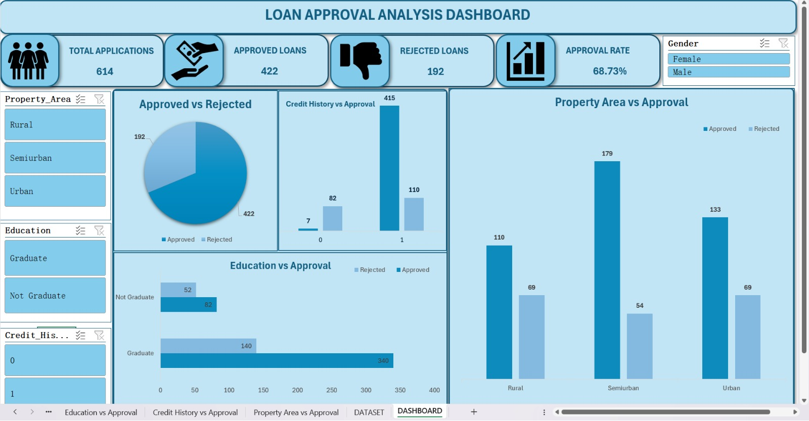

Excel – Loan Analysis Dashboard

Project Overview

This project focuses on analyzing loan application data and presenting meaningful insights through an interactive Excel dashboard.

Tools & Skills

- Microsoft Excel
- Data Cleaning
- Pivot Tables
- Excel Formulas
- Data Visualization
- Dashboard Development

Key Analysis

- Analyzed loan application and approval trends
- Examined loan amounts and applicant information
- Identified important patterns in loan performance
- Created charts and dashboard visuals

Dashboard

Project File

[Download Excel Dashboard](Loan_Analysis_Dashboard.xlsx.xlsx)
