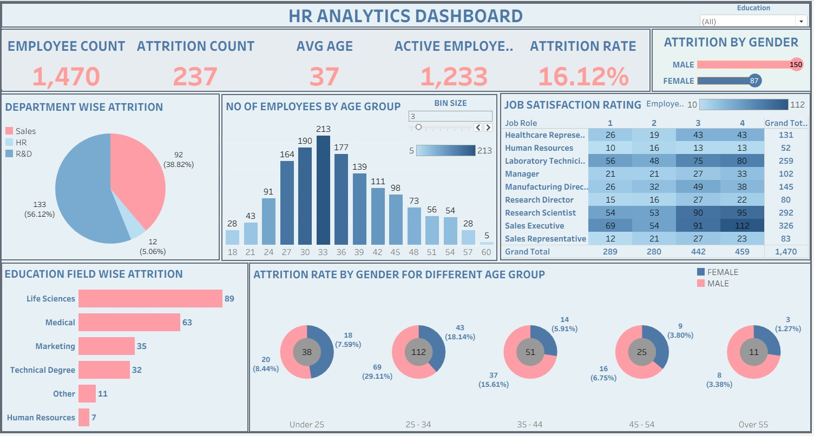

Tableau – HR Analytics Dashboard

Project Overview

This project focuses on analyzing employee and HR data to identify workforce trends and present useful HR insights through an interactive Tableau dashboard.

Tools & Skills

- Tableau
- Data Cleaning
- Data Visualization
- Calculated Fields
- Filters
- Interactive Dashboard Development

Key Analysis

- Analyzed employee and workforce trends
- Examined employee distribution and HR metrics
- Identified important patterns in employee data
- Created interactive charts and visualizations
- Presented HR insights through an interactive dashboard

Dashboard

Project File

[Download Tableau Packaged Workbook](hr%20tableau%20project.twbx)
